# taskmaster

## **Lab26**
 

- **Building the first android app, that have three Activities, the main one have two buttons ("`add task`" , "`all tasks`") and every button lead to another activity.**

- "`add task`": allow users to type in details about a new task, specifically a title and a body. When users click the “submit” button, show a “submitted!” label on the page.
- "`all tasks`": It have a back button and image,without any functionality.

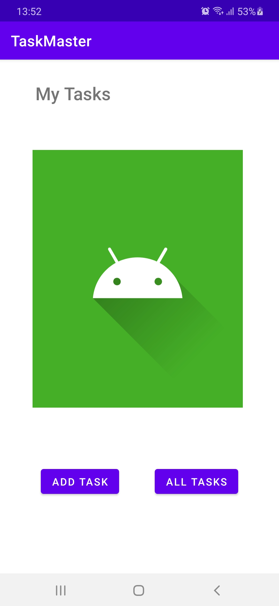

 

## **Lab27**
 

**Feature Tasks**
1. **Task Detail Page**: Creating a Task Detail page. It should have a title at the top of the page, and a Lorem Ipsum description.

2. **Settings Page**: Creating a Settings page. It should allow users to enter their username and hit save.

3. **Homepage**: It contains three different buttons with hardcoded task titles. When a user taps one of the titles, it should go to the Task Detail page, and the title at the top of the page should match the task title that was tapped on the previous page. It contains also a button to visit the Settings page, and once the user has entered their username, it should display “{username}’s tasks” above the three task buttons.

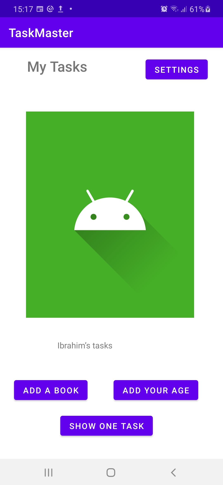

 

## **Lab28**
 

**Feature Tasks**
- Creating a Task class. This Task should have a *title*, a *body*, and a *state*. The state should be one of “new”, “assigned”, “in progress”, or “complete”.
- Refactoring the homepage to use a **RecyclerView** for displaying Task data. This should have hardcoded Task data for now.

* **Methodology**:
    1. First step: Creating the model class "**TaskModel**".
    2. Second: Creating a blank fragment to make a single item each time.
    3. Creating the "**Adapter**" class to bind the data.
    4. Creating the RecyclerView object in the *main* activity, set the layout manager(linear layout manager) and, set the adapter for this recyclerView. 

 

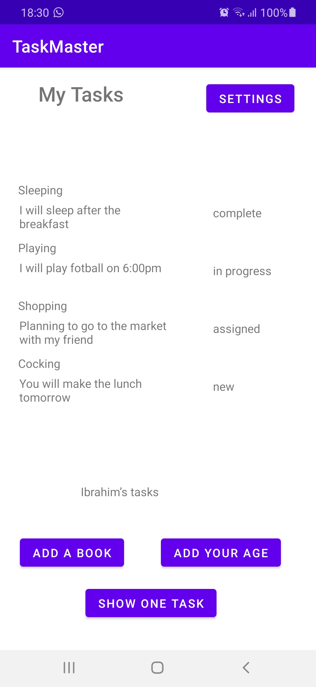

 

## **Lab29**
 

**Feature Tasks**
1. **Task Model and Room**
- Following the directions provided in the Android documentation, set up Room in your application, and modify your Task class to be an Entity.

2. **Add Task Form**
- Modify your Add Task form to save the data entered in as a Task in your local database.

3. **Homepage**
- Refactor your homepage’s RecyclerView to display all Task entities in your database.

4. **Detail Page**
- Ensure that the description and status of a tapped task are also displayed on the detail page, in addition to the title. (Note that you can accomplish this by passing along the entire Task entity, or by passing along only its ID in the intent.)

 

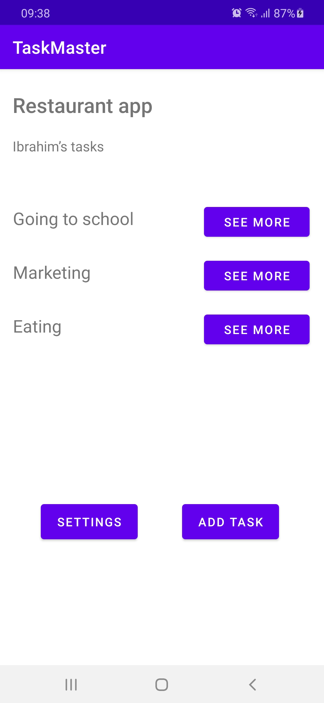

## **Lab31**

- **Feature Tasks**

    - **Espresso Testing:** Adding Espresso to my application, and use it to test basic functionality of the main components of my application
        - For example:

            1. assert that important UI elements are displayed on the page
            2. tap on a task, and assert that the resulting activity displays the name of that task
            3. edit the user’s username, and assert that it says the correct thing on the homepage

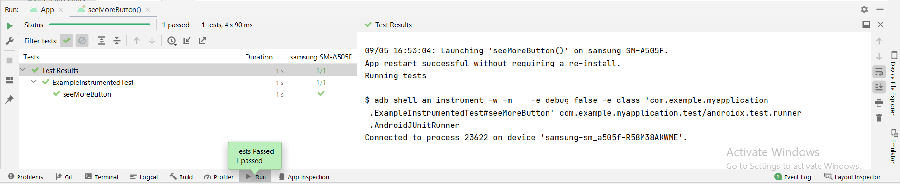

## **Lab32**

- **Feature Tasks**
    1. Tasks Are Cloudy
        - Using the amplify add api command, create a Task resource that replicates our existing Task schema. Update all references to the Task data to instead use AWS Amplify to access your data in DynamoDB instead of in Room.

    2. Add Task Form
        - Modify your Add Task form to save the data entered in as a Task to DynamoDB.

    3. Homepage
       - Refactor your homepage’s RecyclerView to display all Task entities in DynamoDB.

## **Lab33**

- **Feature Tasks**
    1. Tasks Are Owned By Teams
        - Create a second entity for a team, which has a name and a list of tasks. Update your tasks to be owned by a team.

        - Manually create three teams by running a mutation exactly three times in your code. (You do NOT need to allow the user to create new teams.)
    2. Add Task Form
        - Modify your Add Task form to include either a Spinner or Radio Buttons for which team that task belongs to.
    3. Settings Page
        - In addition to a username, allow the user to choose their team on the Settings page. Use that Team to display only that team’s tasks on the homepage.

## **Lab36**

- **Feature Tasks**

1. User Login
    - Add **Cognito** to your Amplify setup. Add in user login and sign up flows to your application, using Cognito’s pre-built UI as appropriate. Display the logged in user’s username somewhere relevant in your app.

2. User Logout
    - Allow users to log out of your application.

 

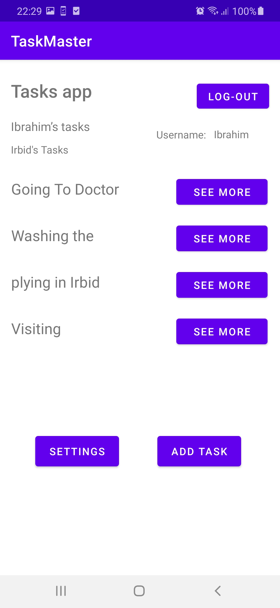

 

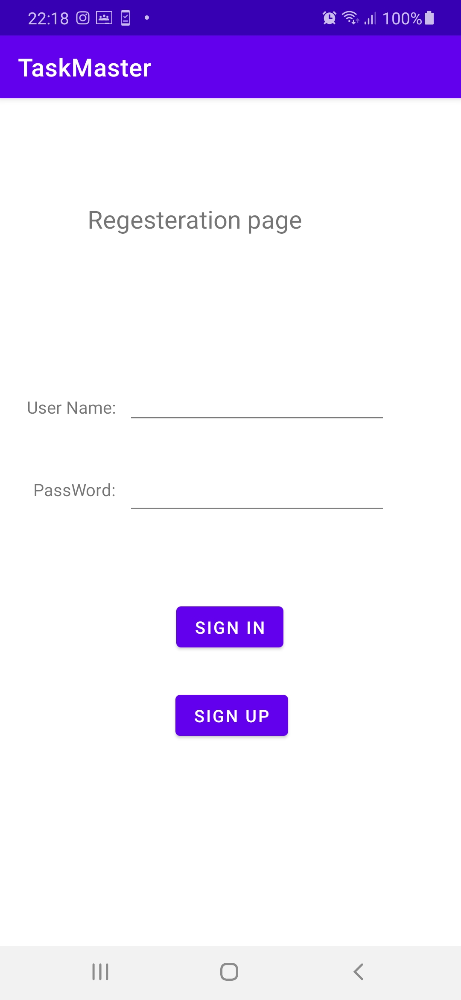

 

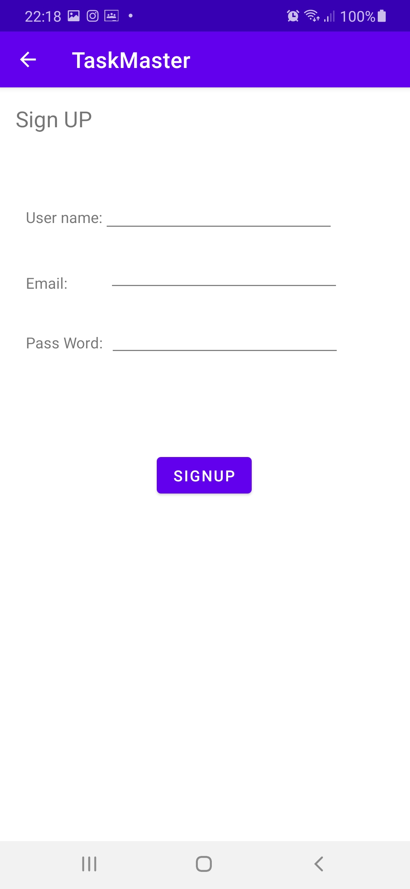

 

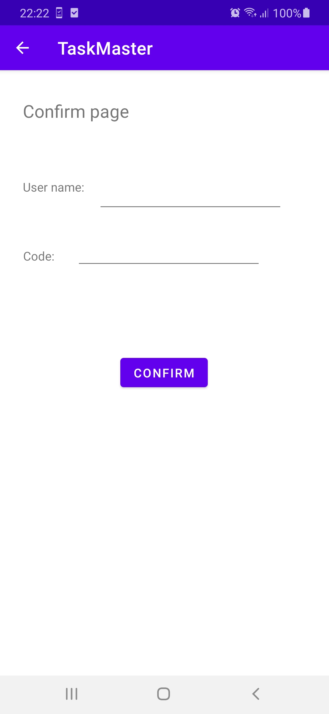

## **Lab37**

- **Feature Tasks**
    1. Uploads
       On the “Add a Task” activity, allow users to optionally select a file to attach to that task. If a user attaches a file to a task, that file should be uploaded to S3, and associated with that task.

       <!-- Implementing a File Picker in Android and copying the selected file to another location -->

    2.  Displaying Files
       On the Task detail activity, if there is a file that is an image associated with a particular Task, that image should be displayed within that activity. (If the file is any other type, you should display a link to it.)

 

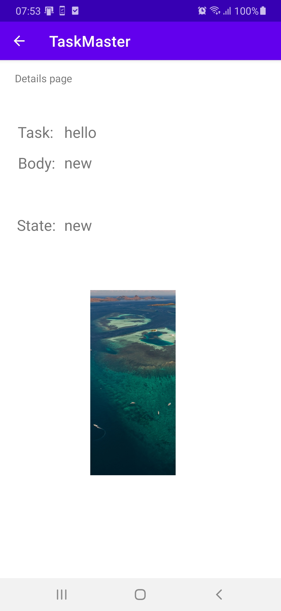

 

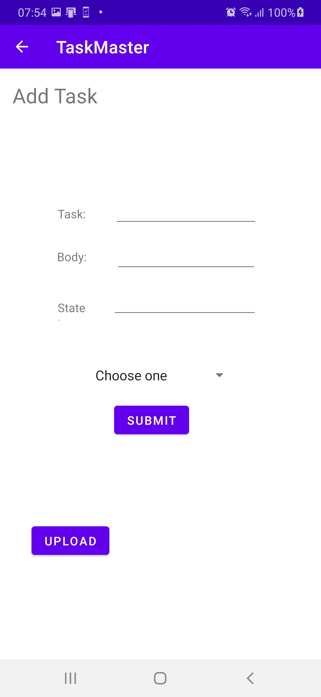